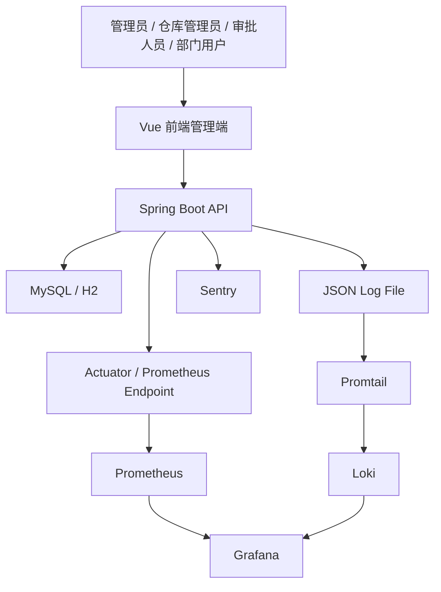
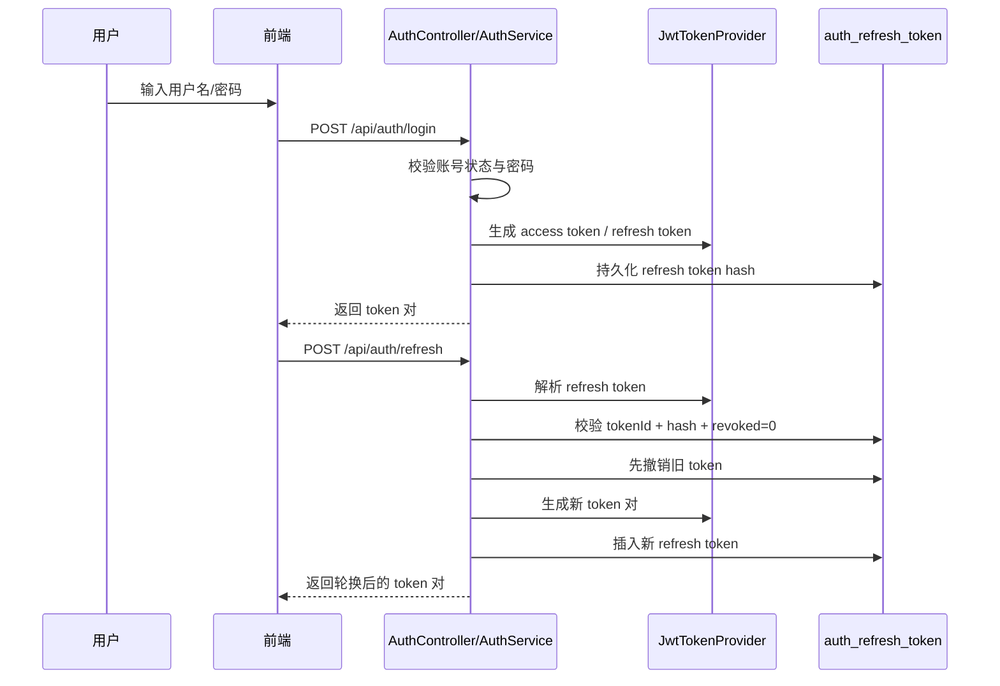
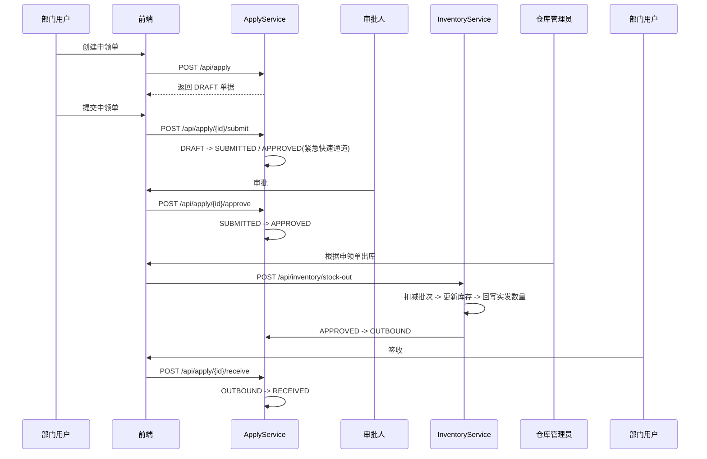
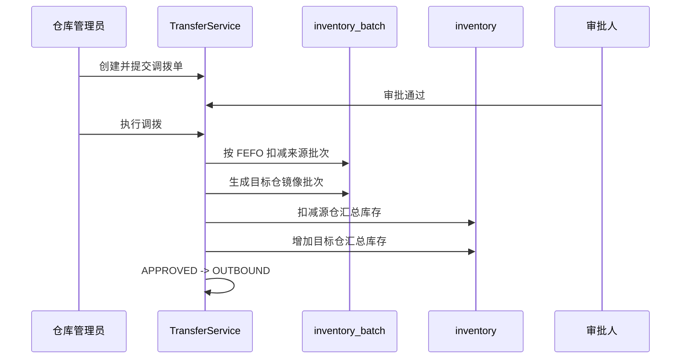
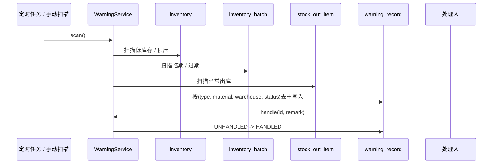
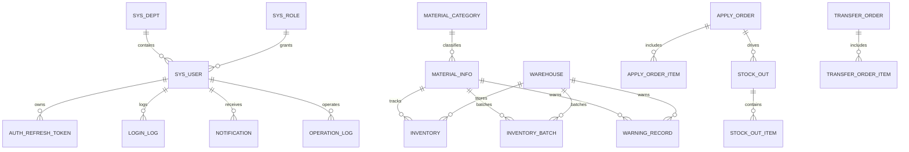
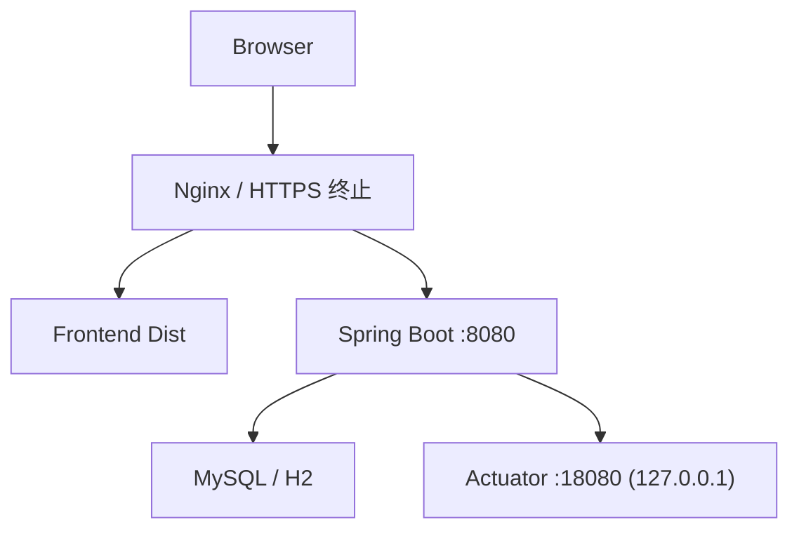
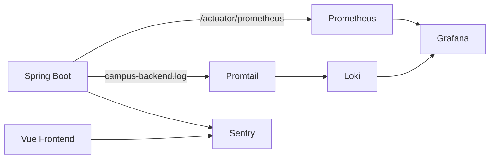

# 架构设计文档

## 0. 当前交付范围与状态

截至 `2026-04-21`，本轮交付聚焦工程化补强，不重写认证模型、RBAC 或核心业务规则。当前架构侧已完成：

- 安全边界：JWT 启动校验、认证与高风险写接口限流、统一安全头
- 数据访问：高增长列表分页化与已识别热点查询优化
- 可测性：后端单测与集成测试、前端单测、Playwright E2E、k6 脚本
- 可观测性：管理端口、Prometheus、JSON 日志、Loki/Promtail、Sentry 降级接入

已完成的本机验收包括：

- 后端 `48` 个测试通过
- 前端构建、单测、E2E 通过
- k6 冒烟脚本可运行
- Prometheus 指标、Loki 日志、Grafana 数据源联调通过

仍需人工前置条件：

- 生产 MySQL、Nginx、HTTPS 证书
- 外部 Sentry DSN 与告警策略

## 1. 文档目标

本系统采用前后端分离架构，部署目标为单机内网环境。本文档说明：

- 系统上下文
- 前后端模块边界
- 核心业务流
- 数据模型主关系
- 认证、限流与安全边界
- 分页与性能策略
- 部署与观测拓扑

## 2. 系统上下文

### 上下文说明

- 前端是当前仓库中业务 API 的主要消费者
- 后端负责认证、权限、业务规则、库存一致性与审计
- 管理端口独立暴露，只绑定本机地址
- 日志、指标和错误追踪分三条链路采集，避免相互耦合

## 3. 前后端模块边界

### 前端模块

- 认证入口：`LoginView`
- 仪表盘与大屏：`DashboardView`、`bigscreen/*`
- 仓储管理：`inventory/*`、`warehouse/*`、`material/*`
- 业务流转：`apply/*`、`transfer/*`
- 安全与事件：`warning/*`、`event/*`、`security/*`
- 平台工具：`log/*`、`notification/*`、`config/*`、`rbac/*`

### 后端模块

- `auth`：登录、刷新、登出、token 生命周期
- `rbac`：用户、角色、部门与权限映射
- `inventory`：库存汇总、批次、入库、出库、盘点
- `apply`：申领单创建、提交、审批、签收
- `transfer`：调拨单创建、审批、执行、签收、调拨推荐
- `warning`：预警扫描、去重、处理
- `log`：登录日志、操作日志
- `notification`：通知列表、未读数、已读/删除
- `material` / `warehouse` / `supplier` / `campus`：基础资料
- `analytics` / `smart` / `algorithm`：统计分析、推荐与算法支撑

### 边界原则

- 前端只负责展示、交互、参数组织与状态反馈，不承载库存规则
- 后端统一落业务状态机、事务边界和审计日志
- 复杂列表统一后端分页，不再走“全量拉取 + 前端本地筛选”

## 4. 核心业务流

### 4.1 登录与刷新

关键规则：

- refresh token 采用单次使用策略
- 旧 token 在成功刷新后立即撤销
- 非测试环境启动时必须提供强 JWT 密钥

### 4.2 申领、审批、出库、签收

关键规则：

- 只有 `SUBMITTED` 状态允许审批或驳回
- 出库时按 FEFO 规则扣减批次
- 申领单出库场景会回写 `ApplyOrderItem.actualQty`

### 4.3 调拨执行

关键规则：

- 批次搬移、汇总库存更新和状态流转在同一事务内完成
- 任何一步失败都整体回滚
- 调拨推荐使用批量预取仓库信息，避免循环内逐条查询

### 4.4 入库与出库

- 入库：新增 `stock_in` / `stock_in_item`，同步增加 `inventory` 和 `inventory_batch`
- 出库：优先校验汇总库存，再按批次扣减，最后更新预警与申领实发量
- 批次选择优先级：`expire_date ASC, id ASC`

### 4.5 预警扫描与处理

关键规则：

- 只对 `UNHANDLED` 预警做去重判断
- 扫描链路批量预取物资信息，避免 `material selectById` 的 N+1
- 扫描耗时与新增预警数量写入业务指标

## 5. 数据库主要实体关系

## 6. 核心表说明

- `auth_refresh_token`：refresh token 持久化与撤销控制，支撑 token 轮换
- `inventory`：物资在仓维度的汇总库存
- `inventory_batch`：物资批次级库存，支撑 FEFO 出库与调拨
- `apply_order` / `apply_order_item`：申领主从表
- `transfer_order` / `transfer_order_item`：调拨主从表
- `warning_record`：预警结果与处理状态
- `login_log` / `operation_log`：安全审计与行为追踪
- `notification`：站内通知、审批提醒、预警提醒

## 7. 认证、限流与安全边界

### 7.1 认证

- 认证模型：JWT + localStorage
- 本轮不改为 Cookie 模型
- `Authorization: Bearer <token>` 为统一访问方式

### 7.2 限流

- 实现：`Bucket4j + Caffeine`
- `/api/auth/login`：按 `IP + username`
- `/api/auth/refresh`：按 `IP + refresh token`
- `/api/warning/scan`、`/api/auth/logout`、`/api/auth/token-cleanup`：高风险写操作按用户或 IP
- 普通读接口不做统一硬限流

### 7.3 安全头

应用层返回：

- `X-Content-Type-Options`
- `X-Frame-Options`
- `Referrer-Policy`
- `Permissions-Policy`
- 最小化 API CSP

部署层返回：

- `HSTS`
- 前端静态资源 CSP

## 8. 分页与性能策略

### 8.1 分页统一策略

- 请求统一 `PageQuery`
- 响应统一 `PageResult<T>`
- 结构固定为 `records / total / page / size`

### 8.2 已落地的热点优化

- `WarningService`：批量预取物资信息，去掉扫描中的 N+1
- `TransferService.recommendTransfer`：批量预取仓库映射
- `InventoryService.stockOut`：申领单出库场景预取 `ApplyOrderItem`

### 8.3 索引策略

重点围绕现有查询模式补强：

- `warning_record (warning_type, material_id, warehouse_id, handle_status)`
- `stock_out_item (created_at, material_id)`
- `inventory_batch (material_id, warehouse_id, expire_date, remain_qty)`
- 日志/通知时间索引

## 9. 部署拓扑

部署约束：

- 前端通过 Nginx 提供静态资源
- 业务 API 走 Nginx 反向代理
- 管理端口只绑定 `127.0.0.1`

## 10. 观测拓扑

## 11. 当前范围外事项

- Cookie / Session 认证模型重构
- Redis 或分布式限流
- 分布式链路追踪
- Kubernetes 化部署
